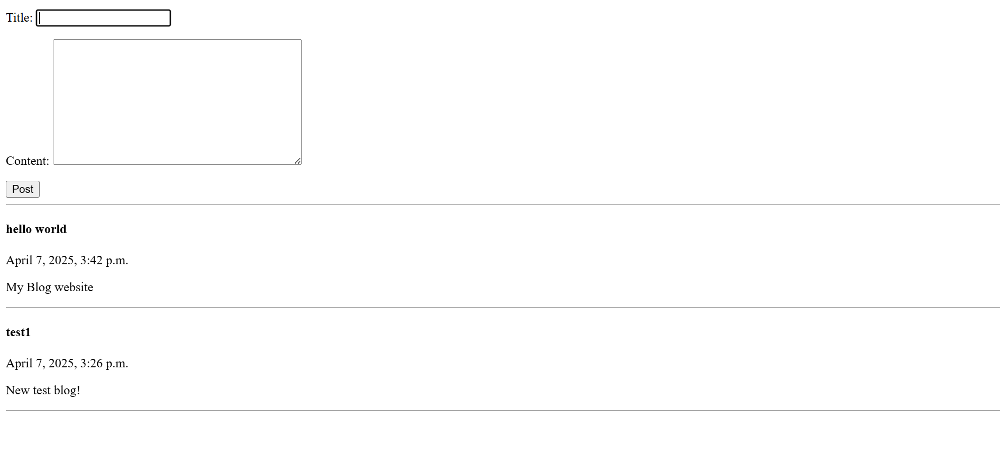
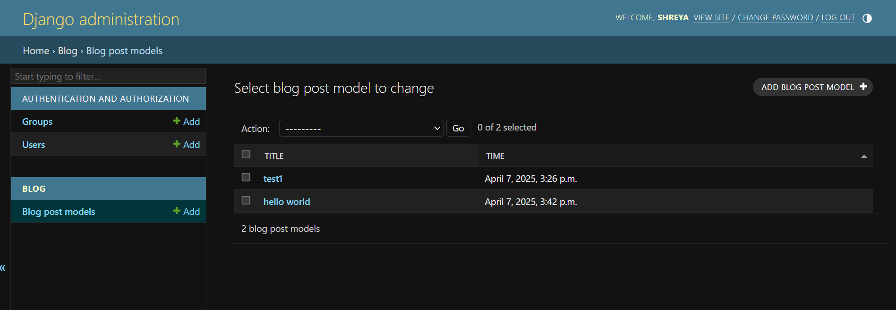

# 📝Mini Blog Website

The website allows users to submit blog posts and view them on the home page.

---
### Home Page with Blog Posts:

### Admin:

---

Through this project, I learnt 
### Models and Migrations
- Created a model `BlogPostModel` with fields like `title`, `content`, `time`

### Why use `HttpResponseRedirect('/')`?
- Prevents accidental **form resubmission**
- Follows the **Post-Redirect-Get** pattern, a good web practice

### CSRF Tokens
- Used `` in the form for security to protect from Cross Site Request Forgery attacks

---

| URL | View Function | Purpose |
|-----|---------------|---------|
| `/` | `archive()` | Displays all posts and the form |
| `/create/` | `create_post()` | Handles form submission |

